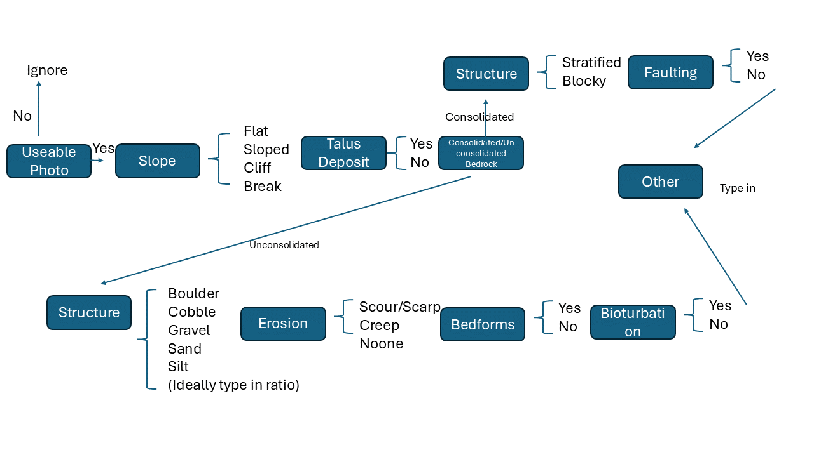

This package is a very simple decision tree tool that can be used to classify images, using user prompts to generate or add to a database file. All credit for the classification scheme and work arising from the code go to Dr Alysha Johnson (alysha.johnson@deakin.edu.au)

  

